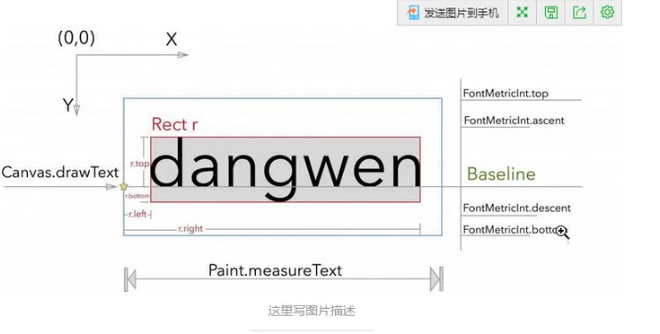
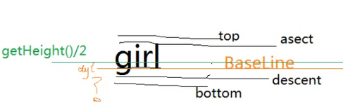

### 指定宽高（三种测量模式）

- AT_MOST(wrap_content)
- EXACTLY(固定值和match_parent)
- UNSPECIFILED()

获取模式和分别使用的简要案例

```java
  		int widthMode = MeasureSpec.getMode(widthMeasureSpec);
        int heightMode = MeasureSpec.getMode(heightMeasureSpec);

        //EXACTLY
        int width = MeasureSpec.getSize(widthMeasureSpec);

        if(widthMode == MeasureSpec.AT_MOST){
            Rect bounds = new Rect();
            mPaint.getTextBounds(mText,0,mText.length(),bounds);
            width = bounds.width();
         }

        int height = MeasureSpec.getSize(heightMeasureSpec);

        if(heightMode == MeasureSpec.AT_MOST){
            Rect bounds = new Rect();
            mPaint.getTextBounds(mText,0,mText.length(),bounds);
            height = bounds.height();
        }
        //设置控件的宽高
        setMeasuredDimension(width,height);
```

### 实现属性

```java
   public CustomTextView(Context context, @Nullable AttributeSet attrs, int defStyleAttr) {
        super(context, attrs, defStyleAttr);
        TypedArray array = context.obtainStyledAttributes(attrs,R.styleable.CustomTextView);

        mText = array.getString(R.styleable.CustomTextView_customText);
        mTextColor = array.getColor(R.styleable.CustomTextView_customTextColor,mTextColor);
        mTextSize = array.getDimensionPixelSize(R.styleable.CustomTextView_customTextSize,sp2px(mTextSize));
       
        array.recycle();

        mPaint = new Paint();
        //抗锯齿
        mPaint.setAntiAlias(true);
        mPaint.setTextSize(mTextSize);
        mPaint.setColor(mTextColor);
    }
```

#### drawText






> drawText 的y是baseline的位置

注意项

- Rect，getTextBounds算高度是不会算ascent和descent的。
- 做padding处理的时候不能获取整个控件的高度。