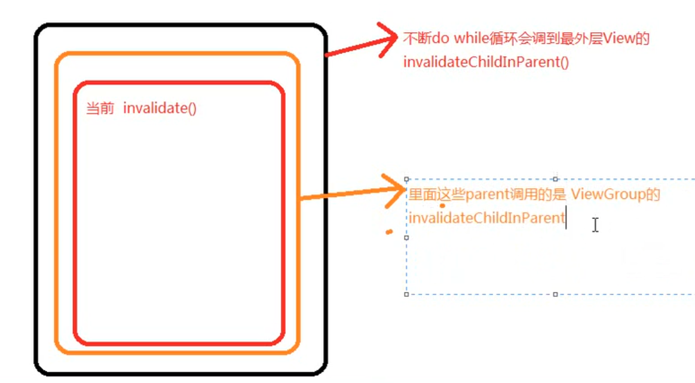

### 仿QQ运动步数进度效果实现思路分析

见代码


### invalidate()

```java
p.invalidateChild(this, damage);
```

ViewGroup.invalidateChild()

```java
......
do {
 ......
    parent = parent.invalidateChildInParent(location, dirty);
    if (view != null) {
        // Account for transform on current parent
        Matrix m = view.getMatrix();
        if (!m.isIdentity()) {
            RectF boundingRect = attachInfo.mTmpTransformRect;
            boundingRect.set(dirty);
            m.mapRect(boundingRect);
            dirty.set((int) Math.floor(boundingRect.left),
                    (int) Math.floor(boundingRect.top),
                    (int) Math.ceil(boundingRect.right),
                    (int) Math.ceil(boundingRect.bottom));
        }
    }
} while (parent != null);
```

会一直找parent直到为null



ViewRootImpl.invalidateChildImpl()

里面有个checkThread，导致UI

不能在子线程更新的原因

```java
void checkThread() {
    if (mThread != Thread.currentThread()) {
        throw new CalledFromWrongThreadException(
                "Only the original thread that created a view hierarchy can touch its views.");
    }
}
```


找到performTraversals()，里面有performMeasure()，performLayout()，performDraw().


performDraw（）->boolean canUseAsync = draw(fullRedrawNeeded, usingAsyncReport && mSyncBuffer); ->drawSoftWare()

```
if (!drawSoftware(surface, mAttachInfo, xOffset, yOffset,
        scalingRequired, dirty, surfaceInsets)) {
    return false;
}
```

->mView.draw(canvas);

->dispatchDraw


### WX朋友圈过度渲染优化

1.网上解决方案

​    1.尽量不要嵌套

​     2.能不设置背景就不要设置背景

 2.最好的解决方案

​    自己画，运行效率最高，但开发效率低