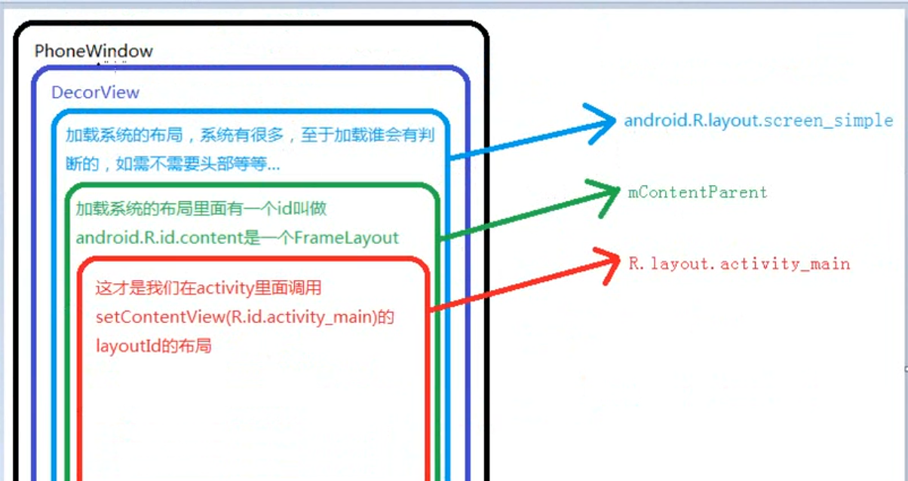

view

setContentView()

会new一个decorView




之所以能够拿到控件的宽高是因为调用了onmeasure()指定的mMeasuredHeight

setContentView 只是创建DecorView 把我们的布局加载到了DecorView


Activity的启动流程 会去掉

 performLaunchActivity——》Activity.onCreate；

handleResumeActivity()

 -》performResumeActivity -》Activity的onResume()方法

-> wm.addView(decor,1); 才开始把decorView加载到WindowManager，这时才开始view的绘制流程 measure() layout() draw()。


```java
mTextView.post(new Runnable(){
   private void run{}
  //保存到Queue中，什么都没干，会在dispatchAttachedToWindow中执行
  //dispatchAttachedToWindow会在测量完毕后调用

})
```


