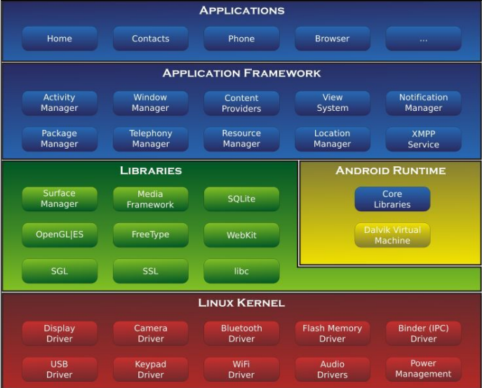

[TOC]

### 安卓系统架构

- **Linux内核层**

   Android系统基于Linux内核，这一层为Android设备的各种硬件提供了底层的驱动。

- **系统运行库层**

   这一层通过一些C/C++库来为安卓系统提供主要的特性支撑。如SQLite库，OpenGL|ES库,Webkit库。此外还有Android运行时库，能够使用java编写Android应用的核心库，Dalvik虚拟机(5.0系统之后改为ART运行环境)。它可以让每一个Android应用运行在独立的进程当中，并且拥有一个Dalvik虚拟机实例。

- **应用框架层**

  提供了构建应用程序时可能用到的各种API。(Android自带的一些核心应用就是利用这些API完成的)

- **应用层**

   安装在手机上的应用程序都属于这一层。



### 四大组件简介

- **Activity**

  应用中能看到的东西都在**活动**中。

- **Service**

  **服务**层在用户退出后依然可以运行。

- **Broadcast** **Receiver**

   允许应用接受来自各处的广播信息，如电话，短信等。也可以向外广播信息。

- **Content** **Provider**

    **内容提供器**可以做应用程序之间的数据共享


### 开发环境

- **JDK**

   采用的java11

- **SDK**

   谷歌提供的Android开发工具包，可使用Android相关的API

- **Anfroid** **Studio**

   开发Android项目的IDE

### 默认项目Hello World

 #### 项目结构分析

```markdown
HelloWorld/
├── app/
│   ├── src/
│   │   └── main/
│   │       ├── java/
│   │       │   └── com/
│   │       │       └── example/
│   │       │           └── myapplication/
│   │       │               └── MainActivity.java
│   │       └── res/
│   │       │   ├── layout/
│   │       │   │   └── activity_main.xml
│   │       │   ├── values/
│   │       │   │   └── strings.xml
│   │       │   ├── drawable/
│   │       │   │   └── ic_launcher.png
│   │       │   ├── minmap-hdpi
│   │       │   ├── minmap-mdpi
│   │       │   ├── minmap-xdpi
│   │       │   ├── minmap-xxdpi
│   │       │   └── minmap-xxxdpi
│   │       │ 
│   │       └── AndroidManifest.xml
│   └── build.gradle
├── gradle
├── build.gradle
├── gradle.properties
├── local.properties
└── settings.gradle
```

- **项目目录(配置文件)**

  - gradle

     包含了gradle wrapper的配置文件。可以自动根据本地的缓存情况决定是否需要下载gradle，AS默认没有启用gradle wrapper。

  - build.gradle

     项目全局的gradle构建脚本。可指定使用的AGP版本。

     ```groovy
     plugins {
         id 'com.android.application' version '7.3.1' apply false
         id 'com.android.library' version '7.3.1' apply false
     }
     
     ```

  - gradle.properties

     全局的gradle配置文件。

  - local.properties

     可指定本机中的SDK路径，在SDK位置发生变化时修改

  - setting.gradle

    用于指定项目中所有引入的模块（一般都是自动生成，不需要手动引入）

- **app目录**

  - androidTest

     用于编写Android Test测试用例

  - AndroidManifest.xml

     整个安卓项目的配置文件，**四大组件**都在这个文件里面注册。

     ```xml
     <activity
         android:name=".MainActivity"
         android:exported="true">
         <intent-filter>
             <action android:name="android.intent.action.MAIN" />
             <category android:name="android.intent.category.LAUNCHER" />
         </intent-filter>
     </activity>
     ```

    intent-filter标签 定义了这Activity可以响应哪些intent

    action 和 category共同决定了这个活动是应用程序点开的第一个活动

  - MainActivity.java

     ```java
     public class MainActivity extends AppCompatActivity {
     
         @Override
         protected void onCreate(Bundle savedInstanceState) {
             super.onCreate(savedInstanceState);
             setContentView(R.layout.activity_main);
         }
     }
     ```

    这个类就是MainActivity这个活动。

    onCreate方法是一个互动被创建时必须要执行的方法。

    setContentView() 给当前活动引入一个activity_main布局。
    
  - res
  
     ```
     └── res/
        ├── layout/                     存放布局文件
        │   └── activity_main.xml
        ├── values/                     存放字符串，样式，颜色等配置
        │   └── strings.xml
        ├── drawable/                   存放图片
        │   └── ic_launcher.png
        ├── minmap-hdpi                 存放应用图标
        ├── minmap-mdpi                 不同的dpi，程序会根据当前设备分辨率，选择
        ├── minmap-xdpi                 加载最合适的图片。drawable也同理
        ├── minmap-xxdpi
        └── minmap-xxxdpi    
     ```
  
     - 两种应用方法
  
       - 代码中
  
         ```
         R.string.app_name   string可换成drawable，layout等
         ```
  
       - XML中
  
         ```
         @string/app_name
         ```
  
         
  
  - build.gradle
  
      ```groovy
      plugins {
          id 'com.android.application'
      } //项目使用的插件
      android {
          namespace 'com.example.myapplication'
          compileSdk 33  //建应用时使用的Android SDK版本。
      
          defaultConfig {
              applicationId "com.example.myapplication"
              minSdk 21  //应用支持的最低Android版本。
              targetSdk 33 //表示在这个版本已经进行过充分的测试 系统会给你一些新的特性和功能
              versionCode 1 //应用版本的代码
              versionName "1.0" //用户可以看到的应用的版本名称
      
              testInstrumentationRunner "androidx.test.runner.AndroidJUnitRunner" //指定用于运行测试的测试运行器。
          }
      
          buildTypes {
              release {
                  minifyEnabled false  //代码是否混淆
                  proguardFiles getDefaultProguardFile('proguard-android-optimize.txt'), 'proguard-rules.pro' //混淆规则
              }
          }  //生成安装包时的不同配置  debug和release
          compileOptions {
              sourceCompatibility JavaVersion.VERSION_11
              targetCompatibility JavaVersion.VERSION_11
          }//java编译项配置
      } //安卓相关的配置
      
      dependencies {
          implementation 'androidx.appcompat:appcompat:1.6.1'
          implementation 'com.google.android.material:material:1.8.0'
          implementation 'androidx.constraintlayout:constraintlayout:2.1.4'   //编译时所需的依赖项
          testImplementation 'junit:junit:4.13.2'                             //测试编译时所需的依赖项
          androidTestImplementation 'androidx.test.ext:junit:1.1.4'
          androidTestImplementation 'androidx.test.espresso:espresso-core:3.5.1'  //Android仪器测试时所需的依赖项
      }
      
      ```


​    

    ### 日志使用

- **Log.v()**

  verbose  打印意义最小的日志信息

- **Log.d()**

  debug 打印调试信息

- **Log.i()**

  info 打印比较重要的数据

- **Log.w()**

  warn 打印警告信息，有**潜在**风险

- **Log.e()**

  error 打印错误信息，立马修改

```java
Log.d(TAG,MESSAGE); //使用方法
```


