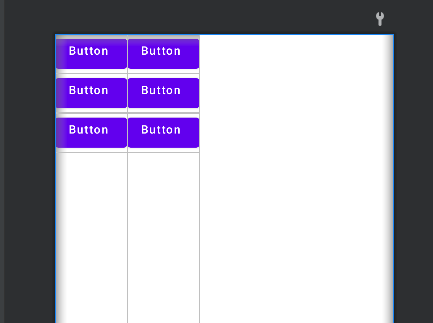
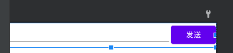
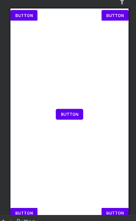
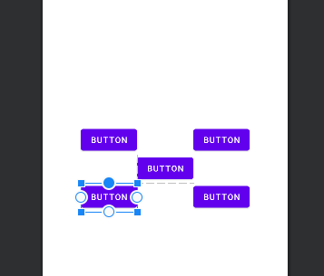
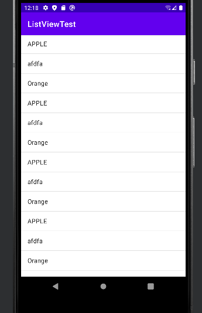
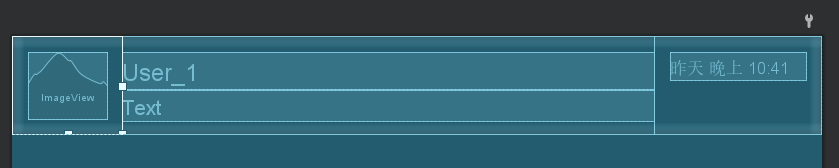
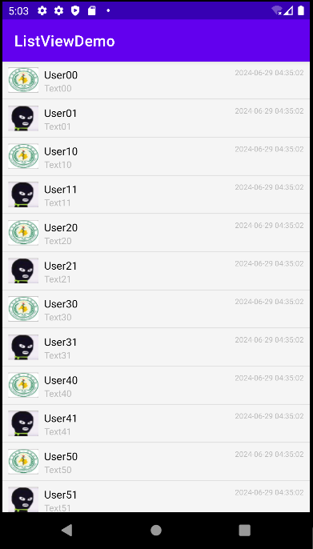
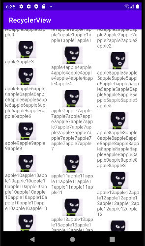

[TOC]


### 常用控件

#### TextView

```xml
<TextView
    android:id="@+id/texr_view"
    android:layout_width="match_parent"
    android:layout_height="wrap_content"
    android:gravity="center"
    android:textSize="25sp"
    android:textColor="#00ff00"
    android:text="这是一个文本框"></TextView>
```

- gravity(对齐方式)

  默认left，right，top，bottom，center等。

  可以用|来指定多个值，center就是 center_vertical|venter_horizontal

- textSize

  字体大小，单位`sp` 与设备的字体大小设置相关联，可以根据用户的系统字体大小首选项进行缩放，因此在不同设备上保持一致的可读性。

- textColor

  字体颜色

- 其他属性参阅文档

  [TextView  | Android Developers (google.cn)](https://developer.android.google.cn/reference/android/widget/TextView?hl=en)

#### Button

```xml
<Button
    android:id="@+id/button"
    android:layout_width="match_parent"
    android:layout_height="wrap_content"
    android:text="Button"
    android:textAllCaps="false"></Button>
```

- textAllCaps

  按钮的文字是否全大写，默认是

- 按钮继承与TextView

##### 按钮的两种注册事件的方式

- 匿名类

  ```java
  //匿名类方式
  button.setOnClickListener(new View.OnClickListener(){
      @Override
      public void onClick(View view){
          // 逻辑
      }
  });
  ```

- 实现接口

  ```java
  public class MainActivity extends AppCompatActivity implements View.OnClickListener{
  
      @Override
      protected void onCreate(Bundle savedInstanceState) {
          super.onCreate(savedInstanceState);
  
          Button button = (Button) findViewById(R.id.button);
          button.setOnClickListerner(this);
  
      }
      @Override
      public void onClick(View v){
          switch(v.getId()) {
              case R.id.button:
                  //逻辑
                  break;
              default:
                  break;
          }
      }
  }
  ```

#### EditText

```xml
<EditText
    android:id="@+id/edit_text"
    android:layout_width="match_parent"
    android:layout_height="wrap_content"
    android:hint="Type something there"
    android:maxLines="2"></EditText>
```

- hint

  提示用户输入内容

- maxLines

- 输入的最大行数，超过多少行时标签不会拉伸，文本会向上滚动

 ##### 结合button获取输入框里面的数据

```java
Button button = (Button) findViewById(R.id.button);
EditText editText = (EditText) findViewById(R.id.edit_text);

button.setOnClickListener(new View.OnClickListener(){
    @Override
    public void onClick(View view){
            String inputText = editText.getText().toString();
        Toast.makeText(MainActivity.this,inputText,Toast.LENGTH_SHORT).show();
    }
});
```

#### ImageView

```xml
<ImageView
    android:id="@+id/image_view"
    android:layout_width="wrap_content"
    android:layout_height="wrap_content"
    android:src="@drawable/img"></ImageView>
```

##### 结合button更换图片

```java
Button button = (Button) findViewById(R.id.button);
EditText editText = (EditText) findViewById(R.id.edit_text);
ImageView imageView = (ImageView) findViewById(R.id.image_view);
//匿名类方式
button.setOnClickListener(new View.OnClickListener(){
    @Override
    public void onClick(View view){
            imageView.setImageResource(R.drawable.img_2);
    }
});
```

#### ProgressBar

```xml
<ProgressBar
    android:id="@+id/progress_bar"
    android:layout_width="match_parent"
    android:layout_height="wrap_content"
    android:visibility="visible"  
    style="?android:attr/progressBarStyleHorizontal"
    android:max="100"></ProgressBar>
```

- visibility

  可见度

  - visible 默认
  - invisible 不可见，但占据位置
  - gone 不可见，不占据位置

- style

  更改进度条样式

- max

  进度条的最大进度

##### button切换透明度

```java
Button button = (Button) findViewById(R.id.button);
ProgressBar progressBar = (ProgressBar) findViewById(R.id.progress_bar);

button.setOnClickListener(new View.OnClickListener(){
    @Override
    public void onClick(View view){

        if(progressBar.getVisibility() == View.GONE){
            progressBar.setVisibility(View.VISIBLE);
        }else{
            progressBar.setVisibility(View.GONE);
        }

    }
});
```

##### button更改进度条进度

```java
Button button = (Button) findViewById(R.id.button);
ProgressBar progressBar = (ProgressBar) findViewById(R.id.progress_bar);

button.setOnClickListener(new View.OnClickListener(){
    @Override
    public void onClick(View view){
        
        int progress = progressBar.getProgress();
        progress += 10;
        progressBar.setProgress(progress);
});
progressBar.setProgress(progress);
```

#### AlertDialog

 弹出一个对话框

```java
 button.setOnClickListener(new View.OnClickListener(){
            @Override
            public void onClick(View view){
                
                AlertDialog.Builder dialog = new AlertDialog.Builder(MainActivity.this);
                dialog.setTitle("这是一个对话框"); //设置标题
                dialog.setMessage("一些提醒"); //设置信息
                dialog.setCancelable(false); //可以被取消吗
                dialog.setPositiveButton("OK", new DialogInterface.OnClickListener() {
                    @Override
                    public void onClick(DialogInterface dialog, int which) {
                        //点击确认的逻辑

                    }
                });
                dialog.setNegativeButton("Cancel", new DialogInterface.OnClickListener() {
                    @Override
                    public void onClick(DialogInterface dialogInterface, int i) {
                        //点击取消的逻辑
                    }
                });
                dialog.show();//弹出对话框
            }
        });
```

#### ProgressDialog

弹出一个进度对话框

```java
 button.setOnClickListener(new View.OnClickListener(){
            @Override
            public void onClick(View view){
                
                ProgressDialog progressDialog = new ProgressDialog(MainActivity.this);
                progressDialog.setTitle("这是一个进度对话框");
                progressDialog.setMessage("Loading....");
                progressDialog.setCancelable(true);
                progressDialog.show();
            }
        });
```

- 会弹出一个带进度条的对话框，多用于比较耗时的加载
- 如果添加了`setCancelable(false)`，则一定要在数据加载完成后调用**`dismiss()`**来关闭对话框


### 四种布局

#### 线性布局

```xml
方便演示，只保留关键属性
<LinearLayout android:orientation="horizontal">
    
    <LinearLayout android:orientation="vertical">
        <Button/>
        <Button/>
        <Button/>
    </LinearLayout>
    
    <LinearLayout android:orientation="vertical">
		<Button/>
        <Button/>
        <Button/>
    </LinearLayout>

</LinearLayout>

```

- orientation

  设置排列方向

  - horizontal 水平
  - vertical 垂直

- 可以通过嵌套实现更复杂的布局，像上面的代码所示

  

- layout_weight

  这个标签是加在子元素身上的，用于使用比例来指定控件的大小。指定了layout_weight的子元素，会按照权重平分剩余的空间

  ```xml
  <LinearLayout android:orientation="horizontal">
  
      <EditText android:layout_weight="1" ></EditText>
      <Button></Button>
      
  </LinearLayout>
  ```



#### 相对布局

##### 相对父元素

```xml
<RelativeLayout>

    <Button
        android:layout_alignParentLeft="true"
        android:layout_alignParentTop="true"/>

    <Button
        android:layout_alignParentRight="true"
        android:layout_alignParentTop="true" />

    <Button
        android:layout_centerInParent="true"/>

    <Button
        android:layout_alignParentLeft="true"
        android:layout_alignParentBottom="true"/>

    <Button
        android:layout_alignParentright="true"
        android:layout_alignParentBottom="true"/>
    
</RelativeLayout>
```

- 属性名一目了然

  

##### 相对同级元素

```xml
<RelativeLayout>

    <Button
        android:id="@+id/button_1"
        android:layout_above="@id/button_3"
        android:layout_toLeftOf="@id/button_3"></Button>

    <Button
        android:id="@+id/button_2"
        android:layout_above="@id/button_3"
        android:layout_toRightOf="@id/button_3"></Button>

    <Button
        android:id="@+id/button_3"
        android:layout_centerInParent="true"></Button>

    <Button

        android:id="@+id/button_4"
        android:layout_below="@id/button_3"
        android:layout_toLeftOf="@id/button_3"></Button>

    <Button
        android:id="@+id/button_5"
        android:layout_below="@id/button_3"
        android:layout_toRightOf="@id/button_3"></Button>
    
</RelativeLayout>
```

- 属性值为相对的同级元素id

  

####  帧布局

- 所有的控件都会默认摆放在左上角
- 可以用layout_gravity指定对齐方式


### 自定义控件

#### 引入布局

   ```xml
   <include layout="@layout/title"></include>
   ```

- 隐藏系统自带的标题

  ```java
  protected void onCreate(Bundle savedInstanceState) {
  
      ActionBar actionbar = getSupportActionBar();
      if(actionbar != null){
          actionbar.hide();
      }  //隐藏系统自带的标题栏
  }
  ```

#### 创建自定义控件

给自定义布局创建一个类继承LinearLayout

```java
public class TitleLayout extends LinearLayout {
    public TitleLayout(Context context, AttributeSet attrs){
        super(context,attrs);
        LayoutInflater.from(context).inflate(R.layout.title,this);
        //inflate 第一个参数是要加载的布局  第二个参数是给加载好的布局添加一个父布局，这里就是TitleLayout
    }
}
```

此时已经可以在布局文件中添加了

```xml
<LinearLayout xmlns:android="http://schemas.android.com/apk/res/android"
    android:layout_width="match_parent"
    android:layout_height="wrap_content">

    <com.example.uicustomviews.TitleLayout
        android:layout_width="match_parent"
        android:layout_height="wrap_content" />
    
</LinearLayout>
```

- 添加自定义控件和普通控件没有区别，只是要写完整包名


给自定义控件注册事件

```java
public class TitleLayout extends LinearLayout {
    public TitleLayout(Context context, AttributeSet attrs){
        super(context,attrs);
        LayoutInflater.from(context).inflate(R.layout.title,this);
        Button titleBack = (Button) findViewById(R.id.title_back);
        Button titleEdit = (Button) findViewById(R.id.title_edit);
        titleBack.setOnClickListener(new OnClickListener() {
            @Override
            public void onClick(View view) {
                ((Activity) getContext()).finish();
            }
        });
        titleEdit.setOnClickListener(new OnClickListener() {
            @Override
            public void onClick(View view) {
                Toast.makeText(getContext(),"你点击了编辑按钮",Toast.LENGTH_SHORT).show();
            }
        });

    }
}
```

### ListView

#### ListView的简单用法

 在布局中添加ListView让他占满整个屏幕

```xml
<LinearLayout xmlns:android="http://schemas.android.com/apk/res/android"
    android:layout_width="match_parent"
    android:layout_height="match_parent">

    <ListView
        android:id="@+id/List_view"
        android:layout_width="match_parent"
        android:layout_height="match_parent"/>

</LinearLayout>
```

在活动中为它添加数据和适配器

```java
public class MainActivity extends AppCompatActivity {

    private String[] data = {"APPLE","afdfa","Orange","APPLE","afdfa","Orange","APPLE","afdfa","Orange","APPLE","afdfa","Orange","APPLE","afdfa","Orange","APPLE","afdfa","Orange"};

    @Override
    protected void onCreate(Bundle savedInstanceState) {
        super.onCreate(savedInstanceState);
        setContentView(R.layout.activity_main);

        //适配器
        //数组中的数据无法直接传递给ListView,需要适配器来完成。
        //Android提供了很多适配器的实现类，这里采用ArrayAdapter,可以通过泛型来指定要适配的数据类型。
        //ArratAdaper有多个构造函数的重载
        //第一个参数  上下文
        //第二个参数  ListView子项布局的id，这里使用了layout.simple_list_item_1。是安卓内置的一个不居文君，只用于简单显示一段文本
        //第三个参数 数据
        ArrayAdapter<String> adapter = new ArrayAdapter<String>(
                MainActivity.this,
                android.R.layout.simple_list_item_1,data);
        ListView listView = (ListView) findViewById(R.id.List_view);
        listView.setAdapter(adapter);
    }
}
```



#### 定制ListView的界面

首先新建一个布局，用于item的自定义布局。(省略不重要属性)

```xml
<LinearLayout  android:orientation="horizontal">
   
    <LinearLayout android:orientation="vertical">
        <ImageView android:id="@+id/userAvatar" ></ImageView>
    </LinearLayout>

    <LinearLayout
        android:layout_weight="1"
        android:orientation="vertical">
        <TextView android:id="@+id/userName"/>
        <TextView android:id="@+id/userText"/>
    </LinearLayout>
    
    <LinearLayout android:orientation="vertical">
        <TextView android:id="@+id/userTime"/>
    </LinearLayout>
    
</LinearLayout>
```



然后定义一个实体类，作为适配器的适配类型

```java
public class User {
    private String userName;
    private String userText;
    private int userAvatar;
    private String userTime;

    public User(String userName,String userText,int userAvatar){
        this.userName = userName;
        this.userText = userText;
        this.userAvatar = userAvatar;
        this.userTime = getCurrentDateTime();
    }
    private String getCurrentDateTime() {
        Calendar calendar = Calendar.getInstance();
        // 创建格式化对象
        SimpleDateFormat sdf = new SimpleDateFormat("yyyy-MM-dd HH:mm:ss");
        // 格式化日期时间
        return sdf.format(calendar.getTime());
    }


    public String getUserName(){
        return userName;
    }
    public String getUserText(){
        return userText;
    }
    public int getUserAvatar(){
        return userAvatar;
    }
    public String getUserTime(){
        return userTime;
    }
}
```

创建一个自定义适配器

```java
public class UserAdapter extends ArrayAdapter<User> {
    private int resourceId;
    public UserAdapter(Context context, int textViewResourceId, List<User> objects){
        //textViewResourceId：列表项布局的资源ID。
        super(context,textViewResourceId,objects);
        resourceId = textViewResourceId;
    }
    @Override
    public View getView(int position, View convertView, ViewGroup parent){
        //int position：当前项在列表中的位置。
        //View convertView：可重用的视图。
        //ViewGroup parent：父视图，用于承载列表项的视图。
        User user = getItem(position); //获取当前项对应的User对象。
        View view = LayoutInflater.from(getContext()).inflate(resourceId,parent,false); //使用布局填充器将列表项布局文件转换为View对象。
        ImageView userAvatar = (ImageView) view.findViewById(R.id.userAvatar);
        TextView userName = (TextView) view.findViewById(R.id.userName);
        TextView userText = (TextView) view.findViewById(R.id.userText);
        TextView userTime = (TextView) view.findViewById(R.id.userTime);

        userAvatar.setImageResource(user.getUserAvatar());
        userName.setText(user.getUserName());
        userText.setText(user.getUserText());
        userTime.setText(user.getUserTime());

        return view;

    }
}
```

在活动中将数据传入适配器

```java
public class MainActivity extends AppCompatActivity {
    private List<User> userList = new ArrayList<>();
    private int userAvatars[] ={
            R.drawable.avatar_1,
            R.drawable.avatar_2,};

    @Override
    protected void onCreate(Bundle savedInstanceState) {
        super.onCreate(savedInstanceState);
        setContentView(R.layout.activity_main);

        initUsers();
        UserAdapter adapter = new UserAdapter(MainActivity.this,R.layout.person_item,userList);
        ListView listView = (ListView) findViewById(R.id.list_view);
        listView.setAdapter(adapter);

    }
    private void initUsers(){
        for (int j = 0; j < 10;j++){
            for (int i = 0; i < userAvatars.length; i++) {
                User user = new User("User"+ j + i,"Text" + j +  i,userAvatars[i]);
                userList.add(user);
            }
        }
    }
}
```



#### 优化ListView的效率

##### convertView

`getView`方法会被系统自动调用。当这些视图需要显示某一项时，它们会调用`Adapter`的`getView`方法来获取该项的视图。当代码在每次调用`getView`方法时都会重新加载布局，这样会影响性能。可以通过`convertView`进行视图复用来优化性能。

- convertView

  这个参数会将之前加载好的布局进行缓存，以便我们进行复用。

  ```java
  View view;
  if(convertView == null){
      view = LayoutInflater.from(getContext()).inflate(resourceId,parent,false);
  }else{
      view = convertView;
  }
  ```

##### ViewHolder

现在虽然不会去重复加载布局了，但还是会重复获取控件id，通过新建内部类`viewHolder`可以减少`findViewById`的调用次数，提高性能。

```java
 public View getView(int position, View convertView, ViewGroup parent){
        User user = getItem(position);
        View view;
        ViewHolder viewHolder;
        if(convertView == null){
            view = LayoutInflater.from(getContext()).inflate(resourceId,parent,false);
            viewHolder = new ViewHolder();
            viewHolder.userAvatar = (ImageView) view.findViewById(R.id.userAvatar);
            viewHolder.userName = (TextView) view.findViewById(R.id.userName);
            viewHolder.userText = (TextView) view.findViewById(R.id.userText);
            viewHolder.userTime = (TextView) view.findViewById(R.id.userTime);

        }else{
            view = convertView;
            viewHolder = (ViewHolder) view.getTag();//重新获取ViewHolder
        }
        

        viewHolder.userAvatar.setImageResource(user.getUserAvatar());
        viewHolder.userName.setText(user.getUserName());
        viewHolder.userText.setText(user.getUserText());
        viewHolder.userTime.setText(user.getUserTime());

        return view;

    }
    class ViewHolder{
        ImageView userAvatar;
        TextView userName;
        TextView userText;
        TextView userTime;
    }
}
```

#### 给item添加点击事件

给ListView注册点击事件，触发事件后，会触发`onItemClick（)`回调函数，根据position参数确认点击的是哪一个子项。

```java
listView.setOnItemClickListener(new AdapterView.OnItemClickListener() {
    @Override
    public void onItemClick(AdapterView<?> adapterView, View view, int position, long id) {
        User user = userList.get(position);
        Toast.makeText(MainActivity.this,user.getUserName(),Toast.LENGTH_SHORT).show();
    }
});
```

### RecyclerView

这个控件不仅可以实现和listView相同的功能，还能实现横向滚动，并且不用手动去优化（重复获取视图，重复调用findByid）

#### RecyclerView的基本用法

因为这个控件是后来新增的所以需要导入

```xml
implementation 'androidx.recyclerview:recyclerview:1.2.1'
```

给`RecylerView`准备一个适配器

```java
public class FruitAdapter extends RecyclerView.Adapter<FruitAdapter.ViewHolder> {
    private List<Fruit> mFruitList;

    static class ViewHolder extends RecyclerView.ViewHolder{
        ImageView fruitImage;
        TextView fruitName;

        public ViewHolder(View view){  //持有每个item的控件
            super(view);
            fruitImage = (ImageView) view.findViewById(R.id.fruit_image);
            fruitName = (TextView) view.findViewById(R.id.fruit_name);
        }
    }

    public FruitAdapter(List<Fruit> fruitList){ //获取要渲染的数据
        mFruitList = fruitList;
    }

    @Override
    public ViewHolder onCreateViewHolder(ViewGroup parent, int viewType) {
        //用于创建新的ViewHolder实例。这个方法会在RecyclerView需要一个新的视图来显示数据项时调用。
        View view = LayoutInflater.from(parent.getContext()).inflate(R.layout.fruit_item,parent,false);
        ViewHolder holder = new ViewHolder(view);
        return holder;
    }

    @Override
    public void onBindViewHolder(ViewHolder holder, int position) {
        //用于将数据绑定到控件上
        Fruit fruit = mFruitList.get(position);
        holder.fruitImage.setImageResource(fruit.getImageId());
        holder.fruitName.setText(fruit.getName());

    }

    @Override
    public int getItemCount() {
        //返回数据项一共有多少个
        return mFruitList.size();
    }
}
```

在活动中使用

```java
public class MainActivity extends AppCompatActivity {

    private List<Fruit> fruitList = new ArrayList<>();

    @Override
    protected void onCreate(Bundle savedInstanceState) {
        super.onCreate(savedInstanceState);
        setContentView(R.layout.activity_main);

        initFruits();
        RecyclerView recyclerView = (RecyclerView) findViewById(R.id.recycler_view);
        LinearLayoutManager layoutManager = new LinearLayoutManager(this);
        recyclerView.setLayoutManager(layoutManager); //获取RecyclerView实例，并设置其布局管理器为LinearLayoutManager，这将使RecyclerView显示为垂直列表。
        FruitAdapter adapter = new FruitAdapter(fruitList);
        recyclerView.setAdapter(adapter);
    }

    private void initFruits(){
        for (int i = 0;i < 20;i++){
            Fruit fruit = new Fruit("apple" + i,R.drawable.ic_launcher_background);
            fruitList.add(fruit);
        }
    }
}
```

最终可以实现和ListView案例一样的效果

#### 横向滑动

只需要将布局管理器中的orientation设置为horizontal就可以了

布局就根据横向的布局调整

```java
layoutManager.setOrientation(LinearLayoutManager.HORIZONTAL);
```

#### 瀑布流布局

布局根据需求调整

只需要将布局管理器更换成Grid布局，并设置列数。

Grid布局，下来另作了解。

```java
StaggeredGridLayoutManager layoutManager = new StaggeredGridLayoutManager(3,StaggeredGridLayoutManager.VERTICAL);
```



#### 注册事件

RecyclerView并没有ListView那样的回调函数来注册事件，它是通过保存子项最外层布局的实例，然后在`onCreateViewHolder`中注册事件。这样就可以指定子项中的某一个控件的事件了。

(省略不重要代码)

```java
 private List<Fruit> mFruitList;

    static class ViewHolder extends RecyclerView.ViewHolder{
        View fruitView; 


        public ViewHolder(View view){
            super(view);
            fruitView = view;//存储子项最外层布局

            fruitImage = (ImageView) view.findViewById(R.id.fruit_image);
            fruitName = (TextView) view.findViewById(R.id.fruit_name);
        }
    }


    @Override
    public ViewHolder onCreateViewHolder(ViewGroup parent, int viewType) {
        View view = LayoutInflater.from(parent.getContext()).inflate(R.layout.fruit_item,parent,false);

        final ViewHolder holder = new ViewHolder(view);
        //匿名内部类（如new View.OnClickListener()）只能访问外围类的final局部变量。这个限制是因为匿名内部类会在方法调用结束后继续存在，而局部变量在方 法调用结束后就会被销毁。如果匿名内部类需要访问一个局部变量，Java会将这个局部变量的副本传递给匿名内部类。为了确保副本和原始变量的一致性，Java要求该局部变量是final的，这样在整个生命周期内都不会改变。
        holder.fruitView.setOnClickListener(new View.OnClickListener() { //注册fruitView控件的事件
            @Override
            public void onClick(View view) {
                int position = holder.getAdapterPosition();
                Fruit fruit = mFruitList.get(position);
                Toast.makeText(view.getContext(),"你点击了文字" + fruit.getName(),Toast.LENGTH_SHORT).show();
            }
        });
        holder.fruitImage.setOnClickListener(new View.OnClickListener() {//注册fruitImage控件的事件
            @Override
            public void onClick(View view) {
                int position = holder.getAdapterPosition();
                Fruit fruit = mFruitList.get(position);
                Toast.makeText(view.getContext(),"你点击了图片" + fruit.getName(),Toast.LENGTH_SHORT).show();
            }
        });
        return holder;
    }
```

