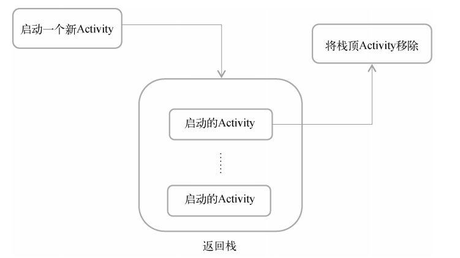
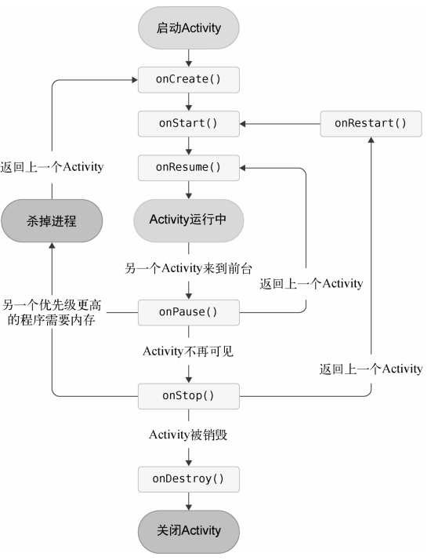
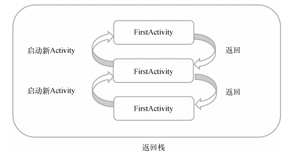
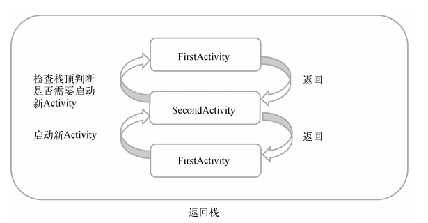
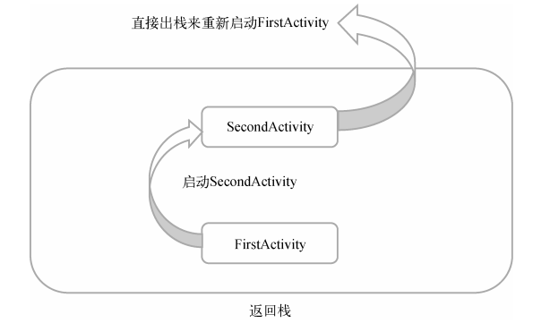
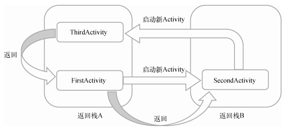

[TOC]

### 活动的基本用法

#### **创建活动**

```java
public class FirstActivity extends AppCompatActivity {
    
    @Override
    protected void onCreate(Bundle savedInstanceState){
        super.onCreate(savedInstanceState)
    }
}
```

#### **创建布局**

> Android程序的设计讲究逻辑和试图分离，最好每一个互动都能对应一个布局

##### 布局XML

```XML
<LinearLayout xmlns:android="http://schemas.android.com/apk/res/android"
    android:layout_width="match_parent"
    android:layout_height="match_parent"
    android:orientation="vertical">

</LinearLayout>
```

###### LinearLayout

- orientation

  子视图排列方式 **horizontal**(水平)，**vertical**(垂直)

- gravity

  子视图的对齐方式 **center**,**left**,**right**,**bottom**,**center_vertical**,**center_horizontal**等。
  
- layout_weight
  加在子视图上，权重较大的视图将获得更多的剩余空间

##### button元素

```xml
<Button
        android:id="@+id/button_1"
        android:layout_width="match_parent"
        android:layout_height="wrap_content"
        android:text="Button2"> 
</Button>
```

- @+id/button_1

  元素的唯一标识符为 button_1，可在代码中通过 **R.id.button_1**引用

- text

  按钮显示的文字

##### 加载布局

```java
public class FirstActivity extends AppCompatActivity {
    
    @Override
    protected void onCreate(Bundle savedInstanceState){
        super.onCreate(savedInstanceState)
        setContentView(R.layout.first_layout);
    }
}
```

- setContentView(R.layout.first_layout);

#### 注册活动

> 所有的活动都需要在**AndroidManifest.xml**中注册才能生效

```xml
<manifest xmlns:android="http://schemas.android.com/apk/res/android"
    xmlns:tools="http://schemas.android.com/tools">

    <application
        android:allowBackup="true"
        android:dataExtractionRules="@xml/data_extraction_rules"
        android:fullBackupContent="@xml/backup_rules"
        android:icon="@mipmap/ic_launcher"
        android:label="@string/app_name"
        android:roundIcon="@mipmap/ic_launcher_round"
        android:supportsRtl="true"
        android:theme="@style/Theme.ActivityTest"
        tools:targetApi="31">
        
        <activity
            android:name=".FirstActivity"
            android:exported="true"
            android:label="这是第一个活动">
            <intent-filter>
                <action android:name="android.intent.action.MAIN" />
                <category android:name="android.intent.category.LAUNCHER" />
            </intent-filter>
        </activity>
        
    </application>

</manifest>
```

- exported

  是否暴露给外部程序。

- label

  活动上方显示的文字

- intent-filter

  action和category在后面的隐式intent中会解释

#### 给元素注册事件

```java
Button button1 = (Button) findViewById(R.id.button_1); //获得 元素对象
button1.setOnClickListener(new View.OnClickListener(){ //给元素添加点击监听器
    @Override
    public void onClick(View v){
        //要执行的代码
        Toast.makeText(FirstActivity.this,"你点击了button 1",Toast.LENGTH_SHORT).show();
        
    }
});
```

##### Toast

```java
Toast.makeText(FirstActivity.this,"你点击了button 1",Toast.LENGTH_SHORT).show();
```

- 第一个参数 **上下文** 一般是互动本身
- 第二个参数 显示的**数据** 
- 第三个参数 显示的**时间**
  - LENGTH_SHORT  约2秒
  - LENGTH_LONG  约3.5秒


#### Menu

1. 在res 中新建目录 menu

2. 再右击menu选择Menu resourse file

3. ```xml
   <menu xmlns:android="http://schemas.android.com/apk/res/android">
    <item android:id="@+id/add_item"
        android:title="添加"/>
    <item android:id="@+id/remove_item"
        android:title="删除"/>
   </menu>
   ```

4. 在互动中添加菜单

   ```java
      @Override
       public boolean onCreateOptionsMenu(Menu menu) {
   
           getMenuInflater().inflate(R.menu.main,menu); //第一个参数，引入资源  第二个参数指定我们的菜单项添加到哪一个菜单对象中
           return true; //允许创建的菜单显示出来
       }
   ```

5. 给菜单项注册事件

   ```java
   @Override
    public boolean onOptionsItemSelected(MenuItem item) {
        switch (item.getItemId()){
            case R.id.add_item:
                Toast.makeText(this,"点击了添加",Toast.LENGTH_SHORT).show();
                break;
            case R.id.remove_item:
                finish();
                Toast.makeText(this,"点击了删除",Toast.LENGTH_SHORT).show();
                break;
            default:
        }
        return true;
    }
   ```

#### 销毁活动

```java
finsh() //和按下back键一样
```

### Intent

##### 显示Intent

- 页面跳转

  ```java
   public void onClick(View view) {
        Intent intent = new Intent(SecondActivity.this,FirstActivity.class);
        //从活动二到活动一
        startActivity(intent);
   }
  ```

##### 隐式Intent

 通过指定action和category，让系统去分析这个Intent，并找出合适的活动去启动

- 注册

```xml
<activity
    android:launchMode="singleInstance"
    android:name=".SecondActivity"
    android:exported="false"
    android:label="这是第二个活动">
    <!-- exported false仅供应用程序内部使用 -->
    <intent-filter>
        <action android:name="com.example.activitytest.ACTION_START" />
        <category android:name="android.intent.category.DEFAULT" />
        <!-- 默认的cateagory，再调用satartActivity时会自动添加Intent中 -->
        <category android:name="com.example.activitytest.MY_CATEGORY" />
    </intent-filter>
</activity>
```

- 使用

```java
   public void onClick(View v){
       Intent intent = new Intent("com.example.activitytest.ACTION_START");
       intent.addCategory("com.example.activitytest.MY_CATEGORY");
       startActivity(intent);  //会自动添加默认的cateagory
       Toast.makeText(FirstActivity.this,"你点击了button1",Toast.LENGTH_SHORT).show();
   }
```

##### 隐式Intent的拓展

###### Uri

统一资源请求符

隐式 Intent 使用动作（action）、类别（category）和数据（data）来描述要执行的任务，而不指定目标组件。系统会根据这些信息找到合适的组件来处理 Intent。

因此配合Uri可以调用一些程序外的资源。

常见示例

- Web 页面: `http://www.example.com`

- 电话号码: `tel:123456789`

- 地图位置: `geo:37.7749,-122.4194`

- 联系人: `content://contacts/people/1`

  ```java
  Intent intent = new Intent(Intent.ACTION_DIAL); //打电话的例子
  intent.setData(Uri.parse("tel:123456789"));
  if (intent.resolveActivity(getPackageManager()) != null) {
  //检查是否有程序可以执行这个Intent，防止崩溃
      startActivity(intent);
  }
  ```

###### 活动之间传递数据

- 给下一个活动传递

   ```java
   // FirstActivity
   public void onClick(View view) {
       String data = "hello SecondtActivity";
       //传给下一个活动
       Intent intent = new Intent(FirstActivity.this,SecondeActivity.class);
       intent.putExtra("extra_data",data);
       startActivity(intent);
   }
   
   //SecondActivity
   @Override
   public void onCreate(Bundle savedInstanceState) {
       ...
   
       Intent intent = getIntent();
       String data = intent.getStringExtra("extra_data");
       Log.d(TAG, "onCreate: "+ data);
       
       ...
   }
   ```

- 给上一个活动传递数据

  - 注册，定义启动活动的契约和结果回调。并在ActivityResultCallback中处理返回结果。

  ```java
  activityResultLauncher = registerForActivityResult(
          new ActivityResultContracts.StartActivityForResult(),
          // 创建一个 ActivityResultContract 实例，用于启动活动并返回结果。
          new ActivityResultCallback<ActivityResult>() {
          // 实现 ActivityResultCallback 接口，用于处理返回的结果。
              @Override
              public void onActivityResult(ActivityResult result) {
                  if(result.getResultCode() == Activity.RESULT_OK){
                      Intent data = result.getData();
                      Log.d(TAG, "onActivityResult: "+data.getStringExtra("resultKey"));
                  }
              }
          }
  );
  ```

  - 启动活动

  ```java
     public void onClick(View view) {
            Intent intent = new Intent(FirstActivity.this, SecondActivity.class);
            activityResultLauncher.launch(intent);
        }
  ```
  
  - 销毁活动2触发回调，传递数据给活动1
  
  ```java
    public void onClick(View view) {
        Intent resultIntent = new Intent();
        resultIntent.putExtra("resultKey","helloFirstActivity");
        setResult(Activity.RESULT_OK,resultIntent);
        finish();
    }
  ```


### Activity的生命周期

#### 四个状态

- 运行状态

   当一个活动位于返回栈的栈顶时，就处于运行状态

- 暂停状态

   不位于栈顶，但可见。比如说位于栈顶的活动是对话框的时候。

- 停止状态

   不位于栈顶，并且完全不可见

- 销毁状态

   当一个活动从返回栈中移除后就变成了销毁状态。



#### 生命周期函数

- onCreate()

  - 和Destroy是一对，活动第一次创建的时候

- onStart()

  - 和Stop是一对，用于处理每次活动进入可见的操作，无论是首次启动还是重新启动。

  - 注册传感器或广播接收器。

- onResume()

  - 和Pause是一对，在准备好与用户开始互动的时候调用，恢复onPause释放的资源，一般在Start后调用。

  - 当活动不处于栈顶，但可见的时候，会只调用这一对函数。

- onPause()

- onStop()

- onDestroy()

- onRestart()

  - 在活动由停止状态重新启动时调用。
  - 通常在 `onStop()` 之后和 `onStart()` 之前调用。

  - 注册在 `onStop()` 期间暂停的资源。



#### 活动被回收了恢复数据

  当一个活动进入到了停止状态，如果系统内存不足将会被回收。这时你在输入框输入的信息，再你返回到这个活动之后就会丢失，因为当你返回的时候，这个活动是再被创建了一次。

##### onSavaInstanceState

- 重写`onSavaInstanceState()`方法

  ```java
  @Override
  public void onSaveInstanceState(Bundle outState) {
      super.onSaveInstanceState(outState);
      String tempData = "临时数据";
      outState.putString("data_key",tempData);
  }
  ```

- 在`onCreate()`中取出保存的数据

```java
@Override
protected void onCreate(Bundle savedInstanceState) {
    if(savedInstanceState != null){
            String tempData = savedInstanceState.getString("data_key");
            Log.d(TAG, "onCreate: " + tempData);
        }
    });
```


### Activity的启动模式

  修改方式（默认为Standard）

```xml
<activity
    android:name=".FirstActivity"
    android:launchMode="singleInstance"  //在注册活动的时候，通过launchModel修改
</activity>
```

- Standard

  启动新活动，不管返回栈里面是否有这个活动，都会创建一个新的实例

  

- singleTop

  当栈顶为当前活动，再启动当前活动不会创建新的实例。但不在栈顶且返回栈里面有这个活动的时候还是会创建新的实例。

  

- singleTask

  整个应用程序的上下文中一个活动只会存在一个实例。实现原理是当需要启动活动的时候，会检查返回栈是否有此活动，如果有就将它上面的所有活动销毁。

  

- singleInstance

   直接启用一个新的返回栈来启动此活动，多用于被其他程序调用。

  


### Activity实践技巧

#### 快速定位处于哪一个活动

新建一个BaseActivity，让他继承AppCompaActivity，然后让所有的活动都继承BaseActivity。

```java
public class BaseActivity extends AppCompatActivity {
    public static final String TAG = "BaseActivity";
    @Override
    public void onCreate(Bundle savedInstanceState) {
        super.onCreate(savedInstanceState);
        Log.d(TAG, getClass().getSimpleName());
        //获取当前实例的类名
    }
```

#### 随时推出程序（一次销毁所有活动）

 新建一个集合类管理所有活动

```java
public class ActivityCollector{
    public static List<Activity> activities = new ArrayList<>();

    public static void addActivity(Activity activity){
        activities.add(activity);
    }
    public static void removeActivity(Activity activity){
        activities.remove(activity);
    }
    public static void finishAll(){
        for(Activity activity : activities) {
            if(!activity.isFinishing()){
                activity.finish();
            }
        }
    }
}
```

在在BaseActivity中把活动添加进集合里或者销毁的时候移出

```java
public class BaseActivity extends AppCompatActivity {
    public static final String TAG = "BaseActivity";
    @Override
    public void onCreate(Bundle savedInstanceState) {
        super.onCreate(savedInstanceState);
        ActivityCollector.addActivity(this); //添加
    }

    @Override
    protected void onDestroy() {
        super.onDestroy();
        ActivityCollector.removeActivity(this); //删除
    }
//    如果你想在其他地方 销毁所有活动只需要调用ActivityCollerctor.
}
```

#### 启动活动的最佳写法

在协同开发中，想启动别人写的活动，但不知道要传几个参数时。

在要启动的活动中添加一个actionStart()方法，所有要启动活动所需要的数据，都通过这个方法传过来。

```java
public static void actionStart(Context context,String data1,String data2){
    Intent intent = new Intent(context,SecondActivity.class);
    intent.putExtra("param1",data1);
    intent.putExtra("param2",data2);
    context.startActivity(intent);
}
```

要启动这个活动，只需要在其他活动调用这个方法。

```java
SecondActivity.actionStart(FirstActivity.this,"data1FromFirst","data2FromFirst");
```
