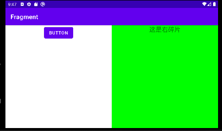

[TOC]

### 碎片简介

一种可以嵌入在活动当中的UI片段，能让程序更加合理充分的利用大屏幕空间。

### 碎片的使用方法

#### 简单用法

在一个活动当中添加两个碎片，并让这两个碎片平分活动空间

1. 新建两个碎片布局

   ```xml
   左碎片
   <LinearLayout
       xmlns:android="http://schemas.android.com/apk/res/android"
       android:layout_width="match_parent"
       android:layout_height="match_parent"
       android:orientation="vertical">
       <Button
           android:id="@+id/button_1"
           android:layout_width="wrap_content"
           android:layout_height="wrap_content"
           android:layout_gravity="center_horizontal"
           android:text="button"></Button>
   </LinearLayout>
   右碎片
   <LinearLayout
       xmlns:android="http://schemas.android.com/apk/res/android"
       android:orientation="vertical"
       android:layout_width="match_parent"
       android:layout_height="match_parent"
       android:background="#00ff00"
       >
       <TextView
           android:layout_width="wrap_content"
           android:layout_height="wrap_content"
           android:layout_gravity="center_horizontal"
           android:textSize="20sp"
           android:text="这是右碎片"/>
   </LinearLayout>
   ```

2. 编写`LeftFragment`类和`RightFragment`类，继承`Fragment`类。重写`onCreateView()`，在方法中通过`inflate()`将上面定义的布局，动态加载进来。

   ```java
   public class LeftFragment extends Fragment {
       @Override
       public View onCreateView( LayoutInflater inflater, ViewGroup container, Bundle savedInstanceState) {
           super.onCreateView(inflater, container, savedInstanceState);
           View view = inflater.inflate(R.layout.left_fragment,container,false);
           return view;
       }
   }
   
   // RightFragment和LeftFragment基本相同
   ```

##### 为什么要动态加载碎片

   **延迟加载**：`Fragment` 的视图只有在需要时才会被创建，而不是在 `Fragment` 实例化时创建。这有助于提高应用的性能和响应速度。

   **灵活性**：通过动态加载布局，你可以根据不同的条件来加载不同的布局。例如，你可以在运行时根据设备的屏幕大小、方向或其他配置来加载不同的布局。

   **视图复用**：`Fragment` 可以在不同的活动中复用。通过动态加载布局，可以确保 `Fragment` 的视图在每个活动中都能正确地展示。

3. 最后修改activity_main.xml

   ```xml
   <LinearLayout
       xmlns:android="http://schemas.android.com/apk/res/android"
       android:orientation="horizontal"
       android:layout_width="match_parent"
       android:layout_height="match_parent"
       >
   
       <androidx.fragment.app.FragmentContainerView
           android:id="@+id/left_fragment"
           android:name="com.example.fragment.LeftFragment"
           android:layout_width="match_parent"
           android:layout_height="match_parent"
           android:layout_weight="1"
          ></androidx.fragment.app.FragmentContainerView>
       <androidx.fragment.app.FragmentContainerView
           android:id="@+id/right_fragment"
           android:name="com.example.fragment.RightFragment"
           android:layout_width="match_parent"
           android:layout_height="match_parent"
           android:layout_weight="1"
           ></androidx.fragment.app.FragmentContainerView>
   
   </LinearLayout>
   ```

   

#### 动态添加碎片

1. 首先添加一个新的碎片(布局和碎片类)

   ```xml
   <LinearLayout
       xmlns:android="http://schemas.android.com/apk/res/android"
       android:orientation="vertical"
       android:layout_width="match_parent"
       android:layout_height="match_parent"
       android:background="#ffff00"
       >
       <TextView
           android:layout_width="wrap_content"
           android:layout_height="wrap_content"
           android:layout_gravity="center_horizontal"
           android:textSize="20sp"
           android:text="这是另一个碎片"/>
   </LinearLayout>
   ```

   ```java
   public class AnotherFragment extends Fragment {
       @Override
       public View onCreateView(LayoutInflater inflater, ViewGroup container, Bundle savedInstanceState) {
           super.onCreateView(inflater, container, savedInstanceState);
           View view = inflater.inflate(R.layout.another_fragment,container,false);
           return view;
       }
   }
   ```

2. 
