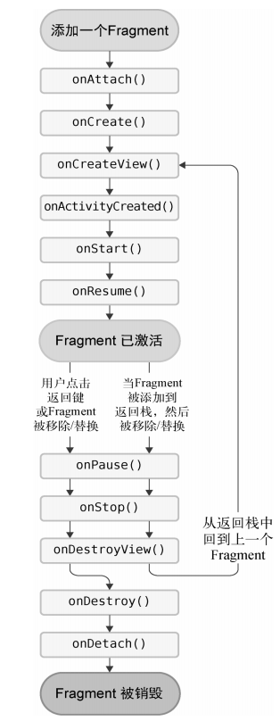

[TOC]

### 碎片简介

一种可以嵌入在活动当中的UI片段，能让程序更加合理充分的利用大屏幕空间。

### 碎片的使用方法

#### 简单用法

在一个活动当中添加两个碎片，并让这两个碎片平分活动空间

1. 新建两个碎片布局

   ```xml
   左碎片
   <LinearLayout
       xmlns:android="http://schemas.android.com/apk/res/android"
       android:layout_width="match_parent"
       android:layout_height="match_parent"
       android:orientation="vertical">
       <Button
           android:id="@+id/button_1"
           android:layout_width="wrap_content"
           android:layout_height="wrap_content"
           android:layout_gravity="center_horizontal"
           android:text="button"></Button>
   </LinearLayout>
   右碎片
   <LinearLayout
       xmlns:android="http://schemas.android.com/apk/res/android"
       android:orientation="vertical"
       android:layout_width="match_parent"
       android:layout_height="match_parent"
       android:background="#00ff00"
       >
       <TextView
           android:layout_width="wrap_content"
           android:layout_height="wrap_content"
           android:layout_gravity="center_horizontal"
           android:textSize="20sp"
           android:text="这是右碎片"/>
   </LinearLayout>
   ```

2. 编写`LeftFragment`类和`RightFragment`类，继承`Fragment`类。重写`onCreateView()`，在方法中通过`inflate()`将上面定义的布局，动态加载进来。

   ```java
   public class LeftFragment extends Fragment {
       @Override
       public View onCreateView( LayoutInflater inflater, ViewGroup container, Bundle savedInstanceState) {
           super.onCreateView(inflater, container, savedInstanceState);
           View view = inflater.inflate(R.layout.left_fragment,container,false);
           return view;
       }
   }
   
   // RightFragment和LeftFragment基本相同
   ```

##### 为什么要动态加载碎片

   **延迟加载**：`Fragment` 的视图只有在需要时才会被创建，而不是在 `Fragment` 实例化时创建。这有助于提高应用的性能和响应速度。

   **灵活性**：通过动态加载布局，你可以根据不同的条件来加载不同的布局。例如，你可以在运行时根据设备的屏幕大小、方向或其他配置来加载不同的布局。

   **视图复用**：`Fragment` 可以在不同的活动中复用。通过动态加载布局，可以确保 `Fragment` 的视图在每个活动中都能正确地展示。

3. 最后修改activity_main.xml

   ```xml
   <LinearLayout
       xmlns:android="http://schemas.android.com/apk/res/android"
       android:orientation="horizontal"
       android:layout_width="match_parent"
       android:layout_height="match_parent"
       >
   
       <androidx.fragment.app.FragmentContainerView
           android:id="@+id/left_fragment"
           android:name="com.example.fragment.LeftFragment"
           android:layout_width="match_parent"
           android:layout_height="match_parent"
           android:layout_weight="1"
          ></androidx.fragment.app.FragmentContainerView>
       <androidx.fragment.app.FragmentContainerView
           android:id="@+id/right_fragment"
           android:name="com.example.fragment.RightFragment"
           android:layout_width="match_parent"
           android:layout_height="match_parent"
           android:layout_weight="1"
           ></androidx.fragment.app.FragmentContainerView>
   
   </LinearLayout>
   ```

   

#### 动态添加碎片

1. 首先添加一个新的碎片(布局和碎片类)

   ```xml
   <LinearLayout
       xmlns:android="http://schemas.android.com/apk/res/android"
       android:orientation="vertical"
       android:layout_width="match_parent"
       android:layout_height="match_parent"
       android:background="#ffff00"
       >
       <TextView
           android:layout_width="wrap_content"
           android:layout_height="wrap_content"
           android:layout_gravity="center_horizontal"
           android:textSize="20sp"
           android:text="这是另一个碎片"/>
   </LinearLayout>
   ```

   ```java
   public class AnotherFragment extends Fragment {
       @Override
       public View onCreateView(LayoutInflater inflater, ViewGroup container, Bundle savedInstanceState) {
           super.onCreateView(inflater, container, savedInstanceState);
           View view = inflater.inflate(R.layout.another_fragment,container,false);
           return view;
       }
   }
   ```

2. 把布局文件中的`android:name`属性去掉，在类中动态添加。

   ```java
   public class LeftFragment extends Fragment {
       @Override
       public View onCreateView( LayoutInflater inflater, ViewGroup container, Bundle savedInstanceState) {
           super.onCreateView(inflater, container, savedInstanceState);
           View view = inflater.inflate(R.layout.left_fragment,container,false);
   
           Button button = view.findViewById(R.id.button_1);
           button.setOnClickListener(new View.OnClickListener() {
               @Override
               public void onClick(View view) {
                   getParentFragmentManager().beginTransaction()
                           .replace(R.id.right_fragment, new AnotherFragment())
                           .addToBackStack(null)
                           .commit();
               }
           });
           return view;
       }
   }
   ```

#### 为碎片添加返回栈

   ```java
   transaction.addToBackStack(null);
   ```

##### 使用场景

1. 简单回退操作:

   ```java
   transaction.replace(R.id.container, new MyFragment());
   transaction.addToBackStack(null);
   transaction.commit();
   ```

   在这种情况下，用户按下返回键时会回退到之前的 `Fragment` 状态。

2. 命名的回退操作:

   ```java
   transaction.replace(R.id.container, new MyFragment());
   transaction.addToBackStack("myTransaction");
   transaction.commit();
   ```

   这样你可以在以后通过 `FragmentManager` 找到这个事务并进行操作。例如：

   ```java
   getSupportFragmentManager().popBackStack("myTransaction", FragmentManager.POP_BACK_STACK_INCLUSIVE);
   ```

##### `FragmentManager` 回退栈操作方法

- **popBackStack()**: 弹出回退栈中的最顶端的事务。比如：

  ```
  getSupportFragmentManager().popBackStack();
  ```
  
- **popBackStack(String name, int flags)**: 弹出回退栈直到找到名称为 `name` 的事务。你可以指定一些标志来改变弹出的行为。

  ```java
  getSupportFragmentManager().popBackStack("myTransaction", 0);
  ```
  
- **popBackStackImmediate()**: 立即执行回退栈的弹出操作，这是一种同步操作，确保在方法返回之前事务已经完成。

  ```java
  getSupportFragmentManager().popBackStackImmediate();
  ```
  
- **popBackStackImmediate(String name, int flags)**: 立即执行带名称和标志的回退栈弹出操作。

  ```java
  getSupportFragmentManager().popBackStackImmediate("myTransaction", 0);
  ```

##### `popBackStack` 参数标志

- POP_BACK_STACK_INCLUSIVE

  包括给定名称的事务在内，一起从回退栈中弹出。

  ```java
  getSupportFragmentManager().popBackStack("myTransaction", FragmentManager.POP_BACK_STACK_INCLU
  ```
  
   

#### 碎片和活动间通信

##### 在活动中调用碎片里的方法

```java
RightFragment rightFragment = (RightFragment) getFragmentManager().findFragmentById(R.id.right_fragment);
```

##### 在碎片中调用活动里的方法

```java
MainActivity activity = (MainActivity) getActivity();
```

##### 在碎片中调用碎片的方法

在一个碎片中通过上面的方法生成活动的实例，再通过活动去获取另一个碎片的实例。


### 碎片的生命周期

#### 碎片的状态和回调

 ###### 状态

和活动的状态一样

- 运行状态
- 暂停状态
- 停止状态
- 销毁状态  碎片的销毁除了跟着活动销毁一起销毁外，还可以通过`FragmentTransaction`的`remove()`,`replace()`方法将碎片从活动中移除，但在事务提交前前调用了了addToBackStack()方法后，这时碎片会进入停止状态.。

###### 回调

碎片包含活动的所有生命周期函数，同时还提供了一些特殊的回调

- onAttach() 当碎片和活动建立关联的时候调用。

- onCreateView() 为碎片创建视图(加载布局)时调用。

- onViewCreated() 确保与碎片相关联的活动一定以及创建完毕的时候调用。

- onDestroyView() 当与碎片关联的视图被移除的时候调用。

- onDetach() 当碎片和活动解除关联的时候调用。

  

### 动态加载布局的技巧

#### 使用限定符

通过在res里面创建layout-large目录，系统就会判断你是否为大屏幕设备，如果是就用这个目录里面的同名布局文件。

-large被称作限定符。

#### 常见的限定符

##### 大小

- small 提供给小屏幕的资源
- normal 提供个中等屏幕设备的资源
- large 提供给大屏幕设备的资源
- xlarge 提给给超大屏幕设备的资源

##### 分辨率

- lpid 低分辨率(120dpi以下)
- mdpi 中分辨率(123dpi - 160dpi)
- hdpi 高分辨率( 160dpi - 240dpi)
- xhdpi 超高分辨率(240dpi - 320dpi)
- xxhdpi 提供给超高分辨率设备的资源(320dpi - 480dpi)

##### 方向

- land 提供给横屏设备的资源
- port 提供给竖屏设备的资源

#### 最小宽度限定符

`layout-sw600dp`表示最小宽度。当屏幕宽度大于600dp的时候就会使用这个目录下的布局。
